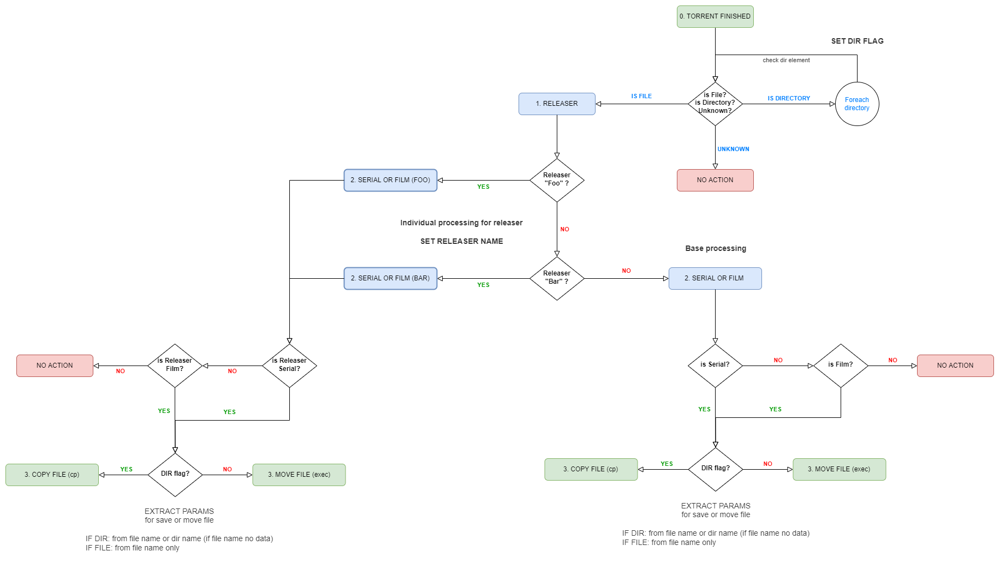

# **Transmission torrentdone application**


## **Оглавление**

<!--ts-->

- [NodeJS приложение transmission-torrentdone-script](#nodejs-приложение-transmission-torrentdone-script)
  - [Установка torrentdone NodeJS пакета](#установка-torrentdone-nodejs-пакета)
  - [Алгоритм обработки торрентов](#алгоритм-обработки-торрентов)
  - [Правила именования торрентов для корректной работы скрипта](#правила-именования-торрентов-для-корректной-работы-скрипта)
    - [Сериалы](#сериалы)
      - [Примеры названия сериалов](#примеры-названия-сериалов)
    - [Фильмы](#фильмы)
- [Скрипт torrentclear](#скрипт-torrentclear)
  - [Установка torrentclear](#установка-torrentclear)
- [Ротация логов](#ротация-логов)
- [Лицензирование](#лицензирование)

<!--te-->

## **Приложение** `transmission-torrentdone-script`

Данный скрипт выполняется после завершения скачивания каждого торрента в Transmission daemon  
Для его работы он должен быть настроен в файле конфигурации через `script-torrent-done-enabled` и `script-torrent-done-filename`

Для более подробной информации изучите статью [Домашний Сервер: Часть 4 – Настройка Transmission daemon в контейнере LXC Proxmox-VE](https://gregory-gost.ru/domashnij-server-chast-4-nastrojka-transmission-daemon-v-kontejnere-lxc-proxmox-ve/)

История версий:

- v2.0.0 - (12.01.2022) Полностью заменен файл **torrentdone.sh** на **NodeJS** проект. Изменена и расширена логика обработки, улучшено логирование (уровни info, debug, etc) и многое другое. Для разработчиков доступно тестирование через Jest.
- v1.2.4 - (17.10.2022) Поправлена обработка имени для папки сериала если это папка с целым сезоном. Вместо имени папки теперь используется имя торрента.
- v1.2.3 - (11.02.2021) Поправлены regex_film и regex_film_dir для определения фильмов. Bash не хочет понимать \d, хотя норм понимает \s. Странности.
- v1.2.2 - (08.02.2021) Поправлено определение фильм или сериал после определения файл или дирректория. Теперь коллекции необходимо корректно именовать.
- v1.2.1 - (26.01.2021) Удален параметр CLEARFLAG т.к. не используется.
- v1.2.0 - (19.01.2021) Доработаны функции обработки файлов сериалов и фильмов. Поправлена работа с именем файла.
- v1.1.0 - (09.01.2021) Переработан алгоритм и функции для работы с торрентами в которых загружаются несколько файлов сразу (т.е. они загружаются папкой с файлами)
- v1.0.0 - (31.03.2020) Исправлена ошибка с кириллическими символами в имени файла при переходе в функцию
- v0.9.16 - (24.03.2020) Улучшено комментирование кода
- v0.9.15 - (21.03.2020) Добавлена обработка торрентов с несколькими файлами (папками). Изменен принцип логирования
- v0.0.8 - (18.04.2018) Изменено регулярное выражение regex_film
- v0.0.7 - (18.04.2018) Улучшено структурирование и комментирование кода
- v0.0.6 - (17.04.2018) Улучшено комментирование кода
- v0.0.5 - (17.04.2018) Изменена версия на корректную
- v0.0.4 - (17.04.2018) Поправлено регулярное выражение regex_film
- v0.0.3 - (17.04.2018) Улучшено комментирование кода
- v0.0.2 - (17.04.2018) Улучшено комментирование кода
- v0.0.1 - (17.04.2018) Исправлены условия определяющие корректно ли перемещен файл
- NV - (17.04.2018) Первая версия

Перед стартом, transmission генерирует переменные в Environment:  
Для версии 3.00

- TR_APP_VERSION: версия Transmission
- TR_TORRENT_ID: идентификатор (ID) торрента
- TR_TORRENT_NAME: имя торента в том виде, как оно отображается в интерфейсе Transmission Remote GUI
- TR_TORRENT_DIR: текущая папка торрента
- TR_TORRENT_HASH: хэш торрента
- TR_TIME_LOCALTIME: дата и время запуска скрипта
- TR_TORRENT_LABELS: тэги/метки присвоенные торренту

Начиная с версии 4.0.0 добавляются еще две

- TR_TORRENT_BYTES_DOWNLOADED: размер загруженных данных в байтах
- TR_TORRENT_TRACKERS: список URL анонсированных трекеров

### **Установка torrentdone NodeJS пакета**

Нужно поставить NodeJS и менеджер пакетов PNPM  
Команды для Proxmox LXC Debian 11.5 as root

```shell
apt update
apt upgrade -y
apt install -y curl gcc g++ make git
```

Пойти в <https://github.com/nodesource/distributions/blob/master/README.md>  
Выбрать LTS версию не ниже 16 (не тестировалось на 18, но работать должно)

```shell
curl -fsSL https://deb.nodesource.com/setup_16.x | bash -
apt update
apt install -y nodejs
```

Устанавливаем глобально менеджер пакетов PNPM

```shell
curl -fsSL https://get.pnpm.io/install.sh | sh -
export PNPM_HOME="/root/.local/share/pnpm"
export PATH="$PNPM_HOME:$PATH"
pnpm -v
7.15.0
```

Далее создаем проект и настраиваем его

```shell
mkdir /opt/torrentdone
cd /opt/torrentdone
git clone https://github.com/GregoryGost/Transmission.git .
pnpm i -P
cd ..
chown -R debian-transmission:debian-transmission torrentdone/
chmod +x torrentdone/dist/main.js
```

Если Вы не хотите ставить PNPM, то можете удалить файл `pnpm-lock.yaml` и использовать стандартную команду `npm ci --only=production` вместо `pnpm i -P`

Задаем постоянные переменные через дополнительные определения настроек в systemd, чтобы не трогать базовый systemd файл.

```shell
mkdir /etc/systemd/system/transmission-daemon.service.d
nano /etc/systemd/system/transmission-daemon.service.d/torrentdone_env.conf
```

```shell
[Service]
Environment="TRANSMISSION_LOGIN=login"
Environment="TRANSMISSION_PASSWORD=password"
```

Возможные переменные окружения для настройки:

Обязательные

- `TRANSMISSION_LOGIN` - Логин авторизации для transmission-remote. Прописан в файле `settings.json` самого Transmission. Как правило располагается по пути `/etc/transmission-daemon/`
- `TRANSMISSION_PASSWORD` - Пароль авторизации для transmission-remote

Опциональные

- `NODE_ENV` - Режим использования приложения. Задать `development` если режим разработки. Default: `production`
- `STORE_MEDIA_PATH` - Путь хранения медиа файлов. Default `/mnt/data/media`
- `ALLOWED_MEDIA_EXTENSIONS` - Расширения файлов перечисленные через запятую для которых осуществляется обработка скриптом. Default: `mkv,mp4,avi`
- `TORRENTDONE_LOG_LEVEL` - Уровень логирования. Default: `info`. Для режима разработки `trace`
- `TORRENTDONE_LOG_FILE_PATH` - Путь до файла сохранения логов. Default: `/var/log/transmission/torrentdone.log`
- `LOG_DATE_FORMAT` - Формат вывода даты в логе. Default: `DD.MM.YYYY HH:mm:ss` Example: 12.11.2022 21:54:03
- `TRANSMISSION_IP_ADDRESS` - IP адрес для доступа к transmission. Default: `127.0.0.1`
- `TRANSMISSION_TCP_PORT` - TCP порт для доступа к transmission. Default: `9091`

Перезапускаем сервис с новыми переменными и смотрим, что они применились.

```shell
systemctl daemon-reload
systemctl restart transmission-daemon.service
systemctl status transmission-daemon.service
Loaded: loaded (/lib/systemd/system/transmission-daemon.service; enabled; vendor preset: enabled)
Drop-In: /etc/systemd/system/transmission-daemon.service.d
         └─torrentdone_env.conf
```

Важно! После изменения значения переменных, необходимо перезапускать сервис через `daemon-reload` и `restart`

### **Алгоритм обработки торрентов**

&nbsp;



### **Правила именования торрентов для корректной работы скрипта**

Нельзя просто так добавлять торренты в **Transmission remote GUI** или кидать торрент файлы в папку отслеживания с данным скриптом.  
Если вы хотите, чтобы парсинг файлов и папок выполнялся корректно, необходимо соблюдать простые правила именования.

#### **Сериалы**

Сериалы обрабатываются с помощью регулярных выражений

Первично определяется релизер. На текущий момент в коде определяется только два релизера `LostFilm.TV` и `NovaFilm.TV`:

Если Вы наблюдаете проблемы с определением, то можете создать запрос в ISSUE

##### **Примеры названия сериалов**

- индивидуальные файлы **LostFilm.TV**:

```shell
The.Mandalorian.S02E07.1080p.rus.LostFilm.TV.mkv
The.Handmaid's.Tale.S05E03.1080p.rus.LostFilm.TV.mkv
Andor.S01E10.720p.rus.LostFilm.TV.mp4
```

- директория **LostFilm.TV** (сезон полностью):

```shell
Obi-Wan Kenobi 1 - LostFilm.TV [1080p]
Breaking Bad 5 - LostFilm.TV [1080p]
Peaky Blinders 6 - LostFilm.TV [1080p]
```

Соответственно в директории файлы имеют названия, как это описано для отдельных файлов сериала.

- индивидуальные файлы **NovaFilm.TV**:

```shell
californication.s06e08.hdtv.rus.eng.novafilm.tv.avi
```

#### **Фильмы**

Фильмы также обрабатываются с помощью регулярных выражений  
Но важно понимать, что учесть все возможные варианты наименований с торрент трекеров достаточно сложно. Именно поэтому нужно

При добавлении одиночного фильма, необходимо его корректно назвать. Год может обрамляться:

- скобками `(2021)`
- нижними подчеркиваниями `_2021_`
- точками `.2021.`
- просто пробелами `2021`
- комбинациями этих обрамлений

Т.е. любой файл, где год обрамлен этими знаками будет корректно вырезан из имени файла.

Корректные примеры названия фильмов:

```shell
Blade Runner 2049 (2017).mkv
Аватар 3D (2009).mkv
```

Для отдельных релизеров реализована отделная обработка файлов фильмов

```shell
All.Quiet.on.the.Western.Front.1080p.rus.LostFilm.TV.mkv
Bullet.Train.1080p.rus.LostFilm.TV.avi
```

Т.е. можно как обычно переименовать файл в понятное и обрабатываемое название, тогда фильм будет сохранен как и положено. Но если ничего не менять, то фильм будет сохранен в папку `2D` и год будет взят текущий.

Если фильмы скачиваются трилогиями, дилогиями и т.д., то необходимо проверять внутренние файлы на наличие в них года. Иначе файл не будет скопирован т.к. не определится год.

## **Ротация логов**

Скрипт по умолчанию пишет результат своей работы в LOG файл **torrentdone.log**  
Log файл располагаются по пути, где обычно хранятся все лог файлы самого transmisson:

```shell
/var/log/transmission/torrentdone.log
```

Начиная с версии 2.0.0 скрипта `torrentdone` расположение лог файла можно задавать самому через конфигурацию. Соответственно необходимо изменять настройки ротации с учётом нового расположения.

Ротация лог файлов обеспечивается подсистемой **logrotate**.  
Ротация происходит для всех лог файлов в папке `/var/log/transmission/`  
Расположение файла настройки ротации логов:

```shell
/etc/logrotate.d/transmission
```

После создания или загрузки файла настройки, необходимо перезапустить службу:

```shell
systemctl restart logrotate.service
```

## **Лицензирование**

Все исходные материалы для проекта распространяются по лицензии [GPL v3](./LICENSE 'Описание лицензии').  
Вы можете использовать проект в любом виде, в том числе и для коммерческой деятельности, но стоит помнить, что автор проекта не дает никаких гарантий на работоспособность исполняемых файлов, а так же не несет никакой ответственности по искам или за нанесенный ущерб.

### Используемые сторонние библиотеки

Основной кодовой базой является программная платформа [NodeJS](https://nodejs.org/) основанная на движке [V8](https://v8.dev/)

- [License NodeJS](https://github.com/nodejs/node/blob/main/LICENSE)
- [License V8](https://chromium.googlesource.com/v8/v8.git/+/master/LICENSE)

Внутренние версии библиотек, типы их лицензирования и информирование пользователей о том, что и как используется в библиотеках данного приложения, находятся строго под ответственностью авторов этих библиотек!

Production dependencies:

- winston: `3.8.2`
- dotenv: `16.0.3` - [BSD 2-Clause "Simplified" License](https://github.com/motdotla/dotenv/blob/v16.0.3/LICENSE) | [Homepage](https://github.com/motdotla/dotenv#readme) | [NPMJS.com](https://www.npmjs.com/package/dotenv) | [GitHub](https://github.com/motdotla/dotenv/tree/v16.0.3)

Development dependencies:

- typescript
  - ts-node
  - @types/node
- jest
  - @types/jest
  - ts-jest
- gulp
  - @types/gulp
  - gulp-typescript
  - gulp-uglify
    - @types/gulp-uglify
- pump
  - @types/pump
- prettier
- eslint
  - eslint-config-prettier
  - eslint-plugin-import
  - eslint-plugin-prettier
  - @typescript-eslint/eslint-plugin
  - @typescript-eslint/parser
